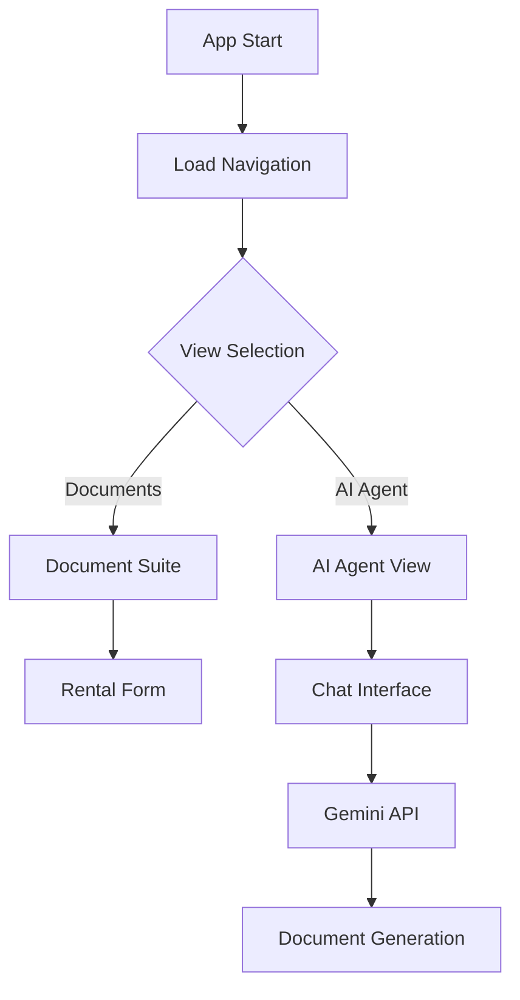

# Shaheen App - نظام إدارة المستندات الذكي

[](https://github.com/beshr11/shaheen-app)
[](https://github.com/beshr11/shaheen-app)
[](https://reactjs.org/)
[](https://www.typescriptlang.org/)

## نظرة عامة | Overview

Shaheen App is an intelligent document management system designed for **شركة أعمال الشاهين للمقاولات** (Shaheen Construction Company). The application provides automated document generation, AI-powered assistance, and comprehensive scaffold rental management.

**Features:**
- 🤖 AI-powered document generation using Google Gemini API
- 📋 Interactive document forms with real-time calculations  
- 🎨 Responsive design with TailwindCSS
- 🔒 Enhanced security features
- 📱 Mobile-friendly interface
- 🖨️ Print-optimized layouts
- 💾 Local memory management for conversations
- 🌐 Arabic RTL support

## بنية المشروع | Project Structure

```
shaheen-app/
├── public/                 # Static assets
├── src/
│   ├── App.js             # Main application component
│   ├── App.test.js        # Comprehensive test suite
│   ├── index.js           # Application entry point
│   └── index.css          # Global styles with Tailwind
├── netlify.toml           # Netlify deployment configuration
├── package.json           # Dependencies and scripts
├── tailwind.config.js     # Tailwind CSS configuration
└── README.md             # This file
```

## الميزات الرئيسية | Key Features

### 1. منظومة المستندات (Document Suite)
- **محضر بدء إيجار الشدات المعدنية**: Scaffold rental commencement forms
- Auto-calculation of daily rates from monthly rates
- Dynamic material quantity tracking
- Print-optimized layouts

### 2. الوكيل الذكي (AI Agent)
- Natural language processing for document requirements
- Intelligent clarification questions
- Memory system for conversation history
- Integration with Google Gemini API

### 3. إدارة الذاكرة (Memory Management)
- Local storage of conversation history
- Similarity-based conversation retrieval
- Search functionality
- Usage statistics

## التقنيات المستخدمة | Technologies Used

- **Frontend**: React 18.2.0 with Hooks
- **Styling**: TailwindCSS with RTL support
- **Icons**: Lucide React
- **AI Integration**: Google Gemini 1.5 Flash API
- **Markdown**: React Markdown for document rendering
- **Testing**: Jest with React Testing Library
- **Deployment**: Netlify with optimized build configuration

## التثبيت والإعداد | Installation & Setup

### المتطلبات المسبقة | Prerequisites

```bash
Node.js >= 18.0.0
npm >= 9.0.0
```

### خطوات التثبيت | Installation Steps

1. **Clone the repository**
```bash
git clone https://github.com/beshr11/shaheen-app.git
cd shaheen-app
```

2. **Install dependencies**
```bash
npm install
```

3. **Environment setup**
```bash
cp .env.example .env.local
# Edit .env.local and add your Gemini API key
```

4. **Start development server**
```bash
npm start
```

5. **Build for production**
```bash
npm run build
```

## إعداد متغيرات البيئة | Environment Variables

Create a `.env.local` file in the root directory:

```env
# Required: Gemini API Key
REACT_APP_GEMINI_API_KEY=your_gemini_api_key_here

# Optional: Development mode
REACT_APP_DEV_MODE=false

# Optional: Analytics
REACT_APP_ANALYTICS_ID=your_analytics_id
```

## الاختبارات | Testing

The application includes a comprehensive test suite covering:

- Component rendering and interaction
- User input validation
- API error handling
- Security features
- Memory management
- Accessibility features

```bash
# Run all tests
npm test

# Run tests with coverage
npm test -- --coverage

# Run tests in watch mode
npm test -- --watchAll
```

## الأمان | Security Features

- **API Key Protection**: Environment variable usage
- **Input Sanitization**: XSS prevention
- **Content Security Policy**: Configured in Netlify
- **Secure Headers**: X-Frame-Options, X-XSS-Protection
- **HTTPS Enforcement**: SSL/TLS in production

## الأداء | Performance Optimizations

- **Code Splitting**: React lazy loading ready
- **Bundle Optimization**: Webpack optimizations
- **Image Optimization**: Responsive images
- **Caching Strategy**: Static asset caching
- **Memory Management**: Efficient state management

## إمكانية الوصول | Accessibility

- **ARIA Labels**: Comprehensive labeling
- **Keyboard Navigation**: Full keyboard support
- **Screen Reader**: Compatible with assistive technologies
- **Color Contrast**: WCAG compliant
- **RTL Support**: Native Arabic text direction

## النشر | Deployment

### Netlify (Recommended)

1. Connect your GitHub repository to Netlify
2. Configure build settings:
   - Build command: `npm run build`
   - Publish directory: `build`
3. Set environment variables in Netlify dashboard
4. Deploy automatically on git push

### Manual Deployment

```bash
npm run build
# Upload the 'build' folder to your hosting provider
```

## هيكل الكود | Code Architecture

### Components Structure

```javascript
App
├── PrintStyles (Global print CSS)
├── Navigation (NavButton components)
├── DocumentSuite
│   └── RentalCommencementNote (Form component)
└── EnhancedAiAgentView (AI chat interface)
    ├── MemoryManager (Conversation storage)
    ├── MessageList (Chat messages)
    └── InputArea (User input)
```

### Key Classes

#### MemoryManager
Handles conversation storage and retrieval:
- `saveConversation()`: Store new conversations
- `getSimilarConversations()`: Find related conversations
- `searchConversations()`: Text-based search
- `getStats()`: Usage analytics

#### Document Components
- **InputField**: Reusable form input with Arabic labels
- **RentalCommencementNote**: Scaffold rental form with calculations
- **PrintStyles**: Optimized CSS for document printing

## واجهة برمجة التطبيقات | API Integration

### Gemini API Usage

```javascript
const response = await fetch(
  `https://generativelanguage.googleapis.com/v1beta/models/gemini-1.5-flash-latest:generateContent?key=${apiKey}`,
  {
    method: 'POST',
    headers: { 'Content-Type': 'application/json' },
    body: JSON.stringify({
      contents: [{ parts: [{ text: prompt }] }]
    })
  }
);
```

## الصيانة والتطوير | Maintenance & Development

### Adding New Document Types

1. Create new component in `src/components/`
2. Add to `documents` object in `DocumentSuite`
3. Update `docTypes` array in `EnhancedAiAgentView`
4. Add corresponding tests

### Extending AI Capabilities

1. Update `generateClarificationQuestions()` function
2. Modify prompt templates in `generateDocument()`
3. Add new conversation types to `MemoryManager`

## استكشاف الأخطاء | Troubleshooting

### Common Issues

1. **Build Fails**
   ```bash
   npm install
   npm audit fix
   ```

2. **API Key Not Working**
   - Verify key in `.env.local`
   - Check Gemini API quota
   - Ensure proper CORS settings

3. **Arabic Text Issues**
   - Verify RTL direction in CSS
   - Check font loading
   - Validate Unicode encoding

## المساهمة | Contributing

1. Fork the repository
2. Create feature branch (`git checkout -b feature/AmazingFeature`)
3. Commit changes (`git commit -m 'Add AmazingFeature'`)
4. Push to branch (`git push origin feature/AmazingFeature`)
5. Open Pull Request

## الترخيص | License

This project is licensed under the MIT License - see the [LICENSE](LICENSE) file for details.

## الدعم | Support

For support and questions:
- Create an issue on GitHub
- Contact: info@shaheen.com
- Documentation: [Project Wiki](https://github.com/beshr11/shaheen-app/wiki)

## الإصدارات | Changelog

### v1.0.0 (2024-12-19)
- ✅ Initial release with AI document generation
- ✅ Scaffold rental management system
- ✅ Comprehensive testing suite
- ✅ Security enhancements
- ✅ Netlify deployment configuration
- ✅ Arabic RTL support
- ✅ Mobile responsive design

---

## شرح الوظائف خطوة بخطوة | Step-by-Step Function Explanation

### 1. Application Flow (تدفق التطبيق)



### 2. Memory Management (إدارة الذاكرة)

The `MemoryManager` class handles conversation persistence:

```javascript
// Save conversation with metadata
const conversationId = memoryManager.saveConversation({
    docType: 'عقد إيجار سقالات',
    userInput: 'أريد إنشاء عقد جديد',
    generatedContent: '# العقد المولد...',
    tags: ['عقد', 'إيجار', 'سقالات']
});

// Find similar conversations
const similar = memoryManager.getSimilarConversations(
    'عقد إيجار سقالات', 
    'عقد إيجار للمشروع الجديد', 
    3
);
```

### 3. Document Generation Process (عملية توليد المستندات)

1. **User Input**: User describes document requirements
2. **Question Generation**: AI generates clarification questions
3. **Answer Collection**: System collects user responses
4. **API Call**: Structured prompt sent to Gemini API
5. **Document Creation**: AI generates formatted document
6. **Memory Storage**: Conversation saved for future reference

### 4. Security Implementation (تنفيذ الأمان)

```javascript
// Environment variable usage
const apiKey = process.env.REACT_APP_GEMINI_API_KEY;

// Input sanitization (React handles this automatically)
const sanitizedInput = userInput; // React XSS protection

// CSP headers in netlify.toml
Content-Security-Policy: "default-src 'self'; script-src 'self'..."
```

---

**Built with ❤️ for شركة أعمال الشاهين للمقاولات**
